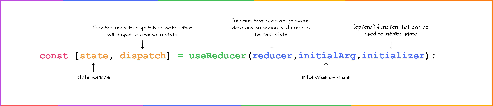

# useReduce Hook

useReducer is a React hook that lets you manage complex state logic in a component.

- It’s an alternative to useState when:

- You have multiple related state variables.

- State updates depend on previous state.

- You want to centralize state logic in a reducer function.

Think of it as Redux-like state management but local to a component.

---

---

syntax:-


## Reducer function  
* The reducer receives current state and an action.

* It returns the new state.

* The state is immutable, so always return a new object, not mutate.

## Dispatch function
Structure of dispatch

You call it like this:

    dispatch({ type: "ACTION_TYPE", payload: someData });


* type → a string describing what action to perform (mandatory).

* payload → any data needed to perform that action or parameters for that function (optional).
---

---

example-
```javascript
import React, { useReducer, useState } from "react";

// Initial state
const initialState = {
  todos: [],
};

// Reducer function
function reducer(state, action) {
  switch (action.type) {
    case "ADD_TODO":
      return {
        ...state,
        todos: [...state.todos, action.payload],
      };
    case "REMOVE_TODO":
      return {
        ...state,
        todos: state.todos.filter((todo, index) => index !== action.payload),
      };
    default:
      return state;
  }
}

function UseReduce() {
  const [state, dispatch] = useReducer(reducer, initialState);
  const [inputValue, setInputValue] = useState("");

  // Separate declared function for adding a todo
  const handleAddTodo = () => {
    if (inputValue.trim() === "") return;
    dispatch({ type: "ADD_TODO", payload: inputValue });
    setInputValue("");
  };

  return (
    <div>
      <h2>Todo List</h2>
      <input
        type="text"
        value={inputValue}
        onChange={(e) => setInputValue(e.target.value)}
      />

      {/* Using declared function */}
      <button onClick={handleAddTodo}>Add Todo</button>

      <ul>
        {state.todos.map((todo, index) => (
          <li key={index}>
            {todo}

            {/* Using anonymous function inline */}
            <button
              onClick={() => dispatch({ type: "REMOVE_TODO", payload: index })}
            >
              Remove
            </button>
          </li>
        ))}
      </ul>
    </div>
  );
}

export default UseReduce;


```
