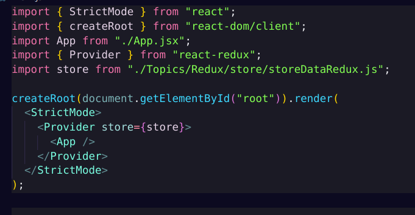

# REDUX

Redux is a state management library used to manage application-level state in predictable, testable, centralized manner.
It is most commonly used with React, but it works with any JS framework.

## Why Redux?

Without Redux (Typical problems)

- State is scattered across many components.

- Deep component trees → props drilling hell.

- Hard to debug → “Who changed this state?”

- Complex apps need shared state (auth, cart, notifications, theme, UI state, API cache).

Redux solves this by:

- Creating one single source of truth → Store

- Updating state using pure functions → reducers

- Triggering updates using actions (plain JS objects)

- Enforcing predictability → same input = same output

- Making state changes traceable → devtools, time-travel debugging

## Basic REDUX

install packages redux & react-redux:

    npm i redux
    npm i react-redux

## Steps

### 1. Create Store using createStore and pass a reducer function to it .

<h4 style="color:yellow">we should not mutate the state</h4> 
<p>
while returning the state in reducer function . always return new state with update values with all properties if any miss data loss.

</p>

```javascript
import { createStore } from "redux";

export const INCREMENT = "increment";
export const DECREMENT = "decrement";

const initialState = { counter: 0 };

function reducerFunction(state = { initialState }, action) {
  if (action.type === INCREMENT) {
    return { counter: state.counter + 1 };
  }
  if (action.type === DECREMENT) {
    return { counter: state.counter - 1 };
  }
  return state;
}

const store = createStore(reducerFunction);

export default store;
```

<p style="color:cyan "> using provider from react-redux to provide the store to all the components by wrapping directly to app component.</p>



### 2. Using the store by useSelector to extract some portion and useDispatch to dispatch actions

```javascript
import React from "react";
import { useSelector, useDispatch } from "react-redux";
import { INCREMENT } from "./store/storeDataRedux";
const Redux = () => {
  const counter = useSelector((state) => state.counter);
  const dispatch = useDispatch();

  const handleClick = () => {
    dispatch({ type: INCREMENT });
  };
  return (
    <div>
      <h2>Redux</h2>
      <p>{counter}</p>
      <button onClick={handleClick}>increase counter</button>
      <p>using redux store </p>
    </div>
  );
};

export default Redux;
```

#### React-Redux provides two main hooks to interact with the Redux store:

- useSelector → Read data from the store

useSelector is a React hook that allows a component to extract the required portion of the Redux state from the store.

    const data = useSelector((state) => state.someSlice.data);

- useDispatch → Send actions to the store

useDispatch returns the dispatch function used to send actions to Redux.

    const dispatch=useDispatch()

## REDUX TOOLKIT

Redux Toolkit (RTK) is the official recommended way to write Redux code.
It solves all major problems of old Redux (boilerplate, complexity, immutability).

    npm i @reduxjs/toolkit

### Traditional Redux problems:

- Too much boilerplate

- Need to manually write:

  - actions

  - actionTypes

  - reducers

  - switch-case

- Hard to manage immutability

- Complex store setup

- Mutating state by mistake

- Hard to scale

### RTK solves this by:

- Auto-creates action types + action creators

- Allows safe state mutation via Immer

- Easy store setup

- Prebuilt reducers (createSlice)

- Built-in Thunks

- Good defaults (middleware, devtools)

## Core APIs of Redux Toolkit

RTK mainly provides 5 important APIs:

1. configureStore()

2. createSlice()

3. createAsyncThunk()

4. createReducer()

5. createAction()

## createSlice()

createSlice is used to write reducer logic in a clean, compact way.

It automatically generates:

- Reducer function

- Action creators

- Action types

syntax-

```
createSlice({
  name,
  initialState,
  reducers,
  extraReducers
})
```

---

## steps:-

1. ### creating a slice:-

use createSlice from reduxjs to create a slice

in redux toolkit we can mutate the state because the redux uses internal packages to manage the immutability

```javascript
import { createSlice } from "@reduxjs/toolkit";
// ---------------------------------------
// MULTIPLIER SLICE (Redux Toolkit)
// ---------------------------------------
export const multiplierSlice = createSlice({
  name: "multiplierSlice",
  initialState: { value: 1 },
  reducers: {
    multiply(state, action) {
      state.value = state.value * action.payload;
    },
  },
});

// Export slice actions
export const mulitplierAction = multiplierSlice.actions;
```

---

## configureStore()

2. ### providing the configured store to all componenets

here we can manage multiple slices or reducer function like old ways by passing object mapped to values in reducer property to the configureStore

```javascript
import { multiplierSlice } from "./MultiplierRedux";
import { reducerFunction } from "./CounterRedux";
import { configureStore } from "@reduxjs/toolkit";
// ---------------------------------------
// STORE CONFIG
// ---------------------------------------
const store = configureStore({
  reducer: {
    counter: reducerFunction,
    multiplier: multiplierSlice.reducer,
  },
});

export default store;
```

---

3. ### Reading and Dispatching slices

here we use that multiplier slice by importing the actions and dispatching it the same way

- while dispatching we can pass payload to the action like in this whatever we pass to action it will go to default payload property of action

        const handleMultiplier = () => {
          dispatch(mulitplierAction.multiply(5)); //dispatching the action with payload
        };

```javascript
import React from "react";
import { useSelector, useDispatch } from "react-redux";
import { INCREMENT } from "./store/CounterRedux";
import { mulitplierAction } from "./store/MultiplierRedux";
import "./Redux.css";

const Redux = () => {
  const counter = useSelector((state) => state.counter.counter);
  const multiplierValue = useSelector((state) => state.multiplier.value); //using the slice
  const dispatch = useDispatch();

  const handleClick = () => {
    dispatch({ type: INCREMENT });
  };

  const handleMultiplier = () => {
    dispatch(mulitplierAction.multiply(5)); //dispatching the action with payload
  };

  return (
    <div className="redux-container">
      <h2>Redux</h2>

      <p>{counter}</p>
      <button className="redux-btn increment" onClick={handleClick}>
        Increase Counter
      </button>

      <p>{multiplierValue}</p>
      <button className="redux-btn multiply" onClick={handleMultiplier}>
        Multiply by 5
      </button>

      <p>Using Redux Store</p>
    </div>
  );
};

export default Redux;
```

in this way we can use this redux toolkit which make easier to handle the redux store
